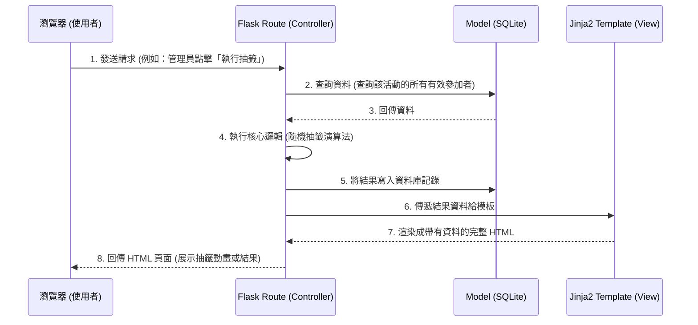

# 系統架構文件 (ARCHITECTURE) - 線上抽籤系統

## 1. 技術架構說明

本專案採用輕量級的 Python Flask 框架，搭配 Jinja2 與 SQLite 來建構，這是一個經典且適合快速開發的衍生 MVC 架構：

- **語言與後端框架：Python + Flask**
  - 原因：Flask 簡單靈活，學習曲線低，且內建各種套件支援，非常適合快速打造 MVP (Minimum Viable Product)。
- **模板引擎：Jinja2**
  - 原因：本專案不採用前後端分離，直接由系統後端渲染 HTML 頁面，Jinja2 能直接把後端的資料（如參加者清單、開獎結果）動態塞進 HTML 模板裡回傳給瀏覽器顯示。
- **資料庫：SQLite**
  - 原因：免安裝獨立伺服器，資料直接存在本地的輕量檔案中，對初期的線上抽籤與少數活動管理來說，效能已經非常足夠。

### Flask MVC 對應說明
- **M (Model, 模型)**：資料庫模型，負責與 SQLite 溝通，定義「活動」、「參加者名單」與「抽籤紀錄」的結構 (Schema)。
- **V (View, 視圖)**：Jinja2 模板（通常是 `.html` 檔）負責畫面的排版設計與靜態資源引入。
- **C (Controller, 控制器)**：Flask 路由（Routes），負責接收來自瀏覽器的 HTTP 請求，呼叫 Model 取得或寫入資料，並處理抽籤隨機派獎等商業邏輯，最後將結果送到 View 進行渲染。

## 2. 專案資料夾結構

建議本專案的資料夾結構如下：

```text
web_app_development/
├── app/
│   ├── __init__.py      ← 初始化 Flask 應用程式實例與全域設定
│   ├── models/          ← (Model) 資料庫模型設計 (如: models.py)
│   ├── routes/          ← (Controller) 路由邏輯，依照功能拆分 (如: auth.py, draw.py)
│   ├── templates/       ← (View) Jinja2 HTML 樣板 (前端頁面結構)
│   └── static/          ← 靜態資源（CSS、JavaScript 互動與動畫、圖片）
│
├── instance/
│   └── database.db      ← SQLite 本地資料庫檔案
│
├── docs/                
│   ├── PRD.md           ← 產品需求文件
│   └── ARCHITECTURE.md  ← 系統技術架構文件 (本文件)
│
├── requirements.txt     ← Python 相依套件清單
└── app.py               ← 應用程式進入點，負責啟動伺服器
```

## 3. 元件關係圖

以下是系統運作核心組件的互動流向：



## 4. 關鍵設計決策

1. **後端渲染 (SSR) 取代單頁應用 (SPA)**
   - **原因**：抽籤系統主要功能為相對單純的表單送出與展示，不需要導入前端框架（如 React/Vue）增加架構複雜度。後端利用 Flask + Jinja2 將畫面渲染好再一次回傳，能夠最大化開發速度。

2. **選擇 SQLite 作為專案資料庫**
   - **原因**：抽籤系統的資料屬性單純且即時性要求高，但初期併發數目較低，SQLite 即可應付。而且不需要花費額外心力管理外部資料庫連線，非常輕便。

3. **模組化拆分 Routes (Blueprints 或功能切分)**
   - **原因**：為了預留擴展性避免 `app.py` 變得肥大，我們將管理員登入等驗證功能切分出來，主系統專注於活動與抽籤路由處理。

4. **基於 Session 的簡易權限控制**
   - **原因**：MVP 階段只區分兩種身分：「能設定抽籤的管理員」與「僅能看結果的一般人」。使用 Flask 輕量內建的 Session 紀錄登入狀態即可保護後台，毋須使用複雜 Token 機制。
