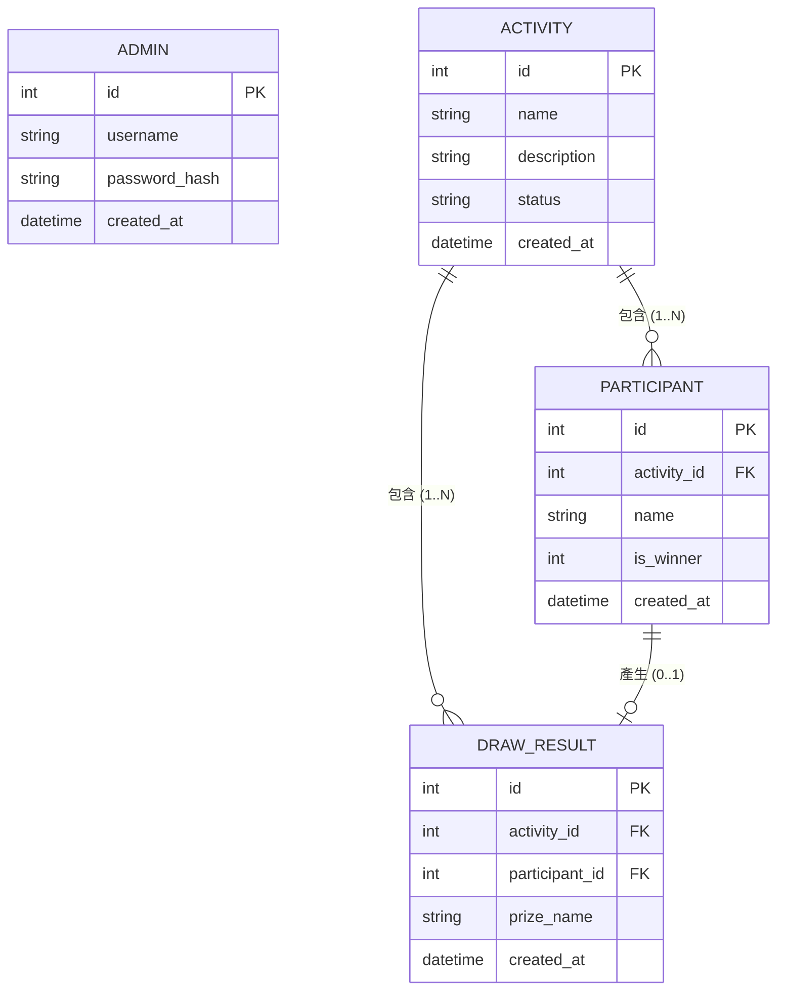

# 資料庫設計文件 (DB DESIGN) - 線上抽籤系統

## 1. ER 圖（實體關係圖）

## 2. 資料表詳細說明

### 2.1. `admin` (系統管理員)
管理系統後台登入的帳號資料表。
- `id` (INTEGER): Primary Key, 管理員 ID，自動遞增。
- `username` (TEXT): 管理員名稱或帳號，必須填寫且不可重複。
- `password_hash` (TEXT): 密碼雜湊值，必須填寫。
- `created_at` (TEXT): 建立時間，記錄於 TEXT 格式的 ISO 字串或 DATETIME，預設為當前時間。

### 2.2. `activity` (抽籤活動)
紀錄每一場發起的抽籤活動資訊。
- `id` (INTEGER): Primary Key, 活動 ID，自動遞增。
- `name` (TEXT): 活動名稱 (如「2026尾牙抽獎」)，必須填寫。
- `description` (TEXT): 活動描述與說明文字。
- `status` (TEXT): 活動狀態，預設為 'ongoing'。未來可擴充 'completed' 或 'pending'。
- `created_at` (TEXT): 建立時間，預設為當前時間。

### 2.3. `participant` (參加者名單)
儲存歸屬於特定抽籤活動的參加人員資料。
- `id` (INTEGER): Primary Key, 參加者 ID，自動遞增。
- `activity_id` (INTEGER): Foreign Key 指向 `activity.id`，必填。標示參加者屬哪一場活動。
- `name` (TEXT): 參加者姓名或代號，必須填寫。
- `is_winner` (INTEGER): 是否已中獎，預設為 `0` (False)。用來避免重複中獎。
- `created_at` (TEXT): 建立時間，預設為當前時間。

### 2.4. `draw_result` (抽籤中獎結果)
紀錄每一次具體被抽中人的隨機結果與得獎獎項。
- `id` (INTEGER): Primary Key, 中獎紀錄 ID，自動遞增。
- `activity_id` (INTEGER): Foreign Key 指向 `activity.id`，關聯至在哪場活動中獎。
- `participant_id` (INTEGER): Foreign Key 指向 `participant.id`，關聯至是誰中獎。
- `prize_name` (TEXT): 獎項名稱 (如「頭獎」、「普獎」)，必須填寫。
- `created_at` (TEXT): 建立時間，預設為開獎當下時間。

## 3. SQL 建表語法與其他檔案
- **SQL 建表語法**: `database/schema.sql`，可一次性建置上述資料表。
- **Python Model 程式碼**: 已於 `app/models/` 目錄建立對應的 `admin.py`, `activity.py`, `participant.py`, `draw_result.py`，以及處理連線共用的 `db.py`。
