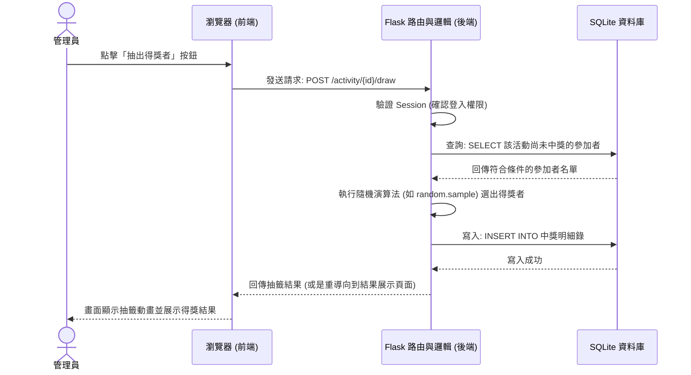

# 流程圖文件 (FLOWCHART) - 線上抽籤系統

本文件根據產品需求文件 (PRD) 與系統架構文件 (ARCHITECTURE)，規劃了系統的使用者流程與核心運作序列圖。

## 1. 使用者流程圖（User Flow）

此流程圖梳理了「管理員」與「一般參與者」進入網頁後的操作動線。

```mermaid
flowchart LR
    A([開啟網站入口]) --> B{是否有管理權限？}
    
    %% 一般參與者動線
    B -->|否| C[訪客：開啟特定活動結果連結]
    C --> D[查看該活動的開獎結果名單]
    
    %% 管理員動線
    B -->|是| E[管理員：登入頁面]
    E --> F{登入成功？}
    F -->|否| E
    F -->|是| G[後台管理總覽 (Dashboard)]
    
    G --> H{選擇操作？}
    
    H -->|1. 新增活動| I[建立新抽籤活動]
    I --> G
    
    H -->|2. 管理現有活動| J[進入單一活動詳情]
    
    J --> K{後續操作}
    K -->|管理名單| L[新增/編輯/批次匯入參加者]
    L --> J
    
    K -->|執行抽籤| M[系統隨機抽籤與動畫]
    M --> N[產生結果並儲存]
    N --> O[查看該活動抽籤結果]
    O --> J
```

## 2. 系統序列圖（Sequence Diagram）

此圖以「管理員點擊執行抽籤」這個核心功能為例，描述前端到後端、再到資料庫的完整互動經過。



## 3. 功能清單對照表

本表列舉系統中最主要的功能，並大略規劃其對應的 URL 路徑與 HTTP 方法，為實際實作的 API/Route 開發做準備。

| 功能名稱 | URL 路徑 | HTTP 方法 | 說明 |
| --- | --- | --- | --- |
| **管理員登入頁面** | `/login` | `GET` | 顯示登入表單 |
| **執行登入驗證** | `/login` | `POST` | 驗證帳號密碼，成功則寫入 Session |
| **管理員登出** | `/logout` | `GET` | 清除 Session 並導向登入頁或首頁 |
| **後台活動總覽** | `/dashboard` | `GET` | 列出目前建立的所有抽籤活動 |
| **建立新活動** | `/activity/create` | `GET` / `POST` | GET 顯示表單；POST 送出建立活動資料 |
| **活動詳情與名單管理** | `/activity/<id>` | `GET` | 顯示該活動詳細資訊與目前參加者名單 |
| **新增/匯入參加者** | `/activity/<id>/participants`| `POST` | 新增單一或批次送出參加者名單 |
| **執行抽籤** | `/activity/<id>/draw` | `POST` | 觸發後端執行特定獎項的抽籤 |
| **查看抽籤結果 (公開)** | `/activity/<id>/results` | `GET` | 展示該場活動的最終開獎名單，供管理員或訪客查詢 |
